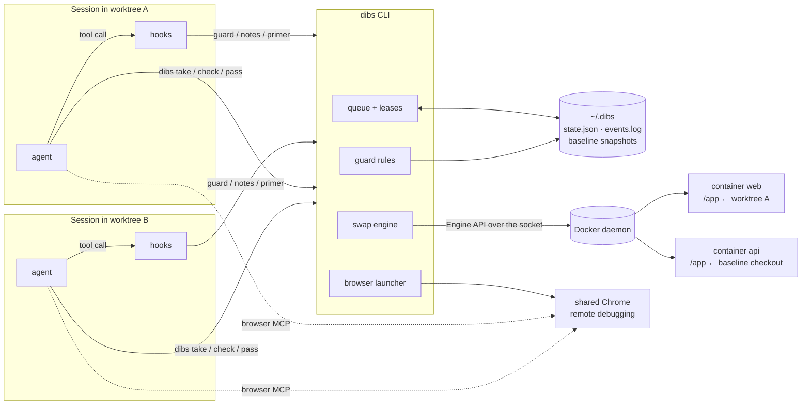

# dibs: design spec

## Problem

A developer works on several tickets in parallel, each in its own git worktree, usually with one coding-agent session per worktree. All of them share a single local Docker stack.

- **Unit tests are easy to isolate.** Copy the worktree's code into a scratch directory inside a container and run the tests there.
- **Testing against the running stack is not.** Browser QA, e2e suites and requests to a service's port need the containers to run *that worktree's* code.

Today, sessions get there by re-pointing a container's code mount, restarting services or switching branches in the main checkout. Each of those silently takes the stack away from whichever session was using it. The victim keeps testing, and its results now describe someone else's code.

Browser automation has the same problem one layer up. A browser-automation MCP server that keeps a persistent profile refuses to start a second browser on that profile, so the second session to ask for a browser gets none.

## Goals

- At most one worktree drives a given container at a time. Everyone else waits in line and is told why.
- Giving a worktree a container is automatic: no project-specific commands and no edits to the compose file.
- No extra copies of containers: one container per service, as today.
- Sessions that are not using the stack (unit tests from a scratch copy, reading logs) keep working.
- Every session knows the mechanism exists, is refused with an actionable message when it would take something, and is told when it has been affected.
- One browser shared by all sessions, with one login.
- Works with any Docker setup: compose, `docker run`, or a wrapper CLI.

## Non-goals

- Running several copies of the stack side by side. That needs more memory than a laptop has, plus per-copy hostnames, ports and auth callbacks.
- Isolating databases or other stateful services. They stay shared.
- Being a security boundary. The guard stops honest mistakes by cooperative agents.

## Approaches considered

| Approach | Why not |
| --- | --- |
| A full copy of the stack per worktree (unique project names and ports) | Multiplies memory by the number of worktrees. Breaks stacks with fixed container names, fixed hostnames, TLS termination or registered auth callbacks. |
| Several copies kept running, one "checked out" onto the canonical ports | Still one copy per worktree. The checkout has no owner, so a second session can take the ports from the first. |
| A supervisor process inside each container that switches the app between worktrees | Needs a stack-specific start script per service, repo-root mounts and privileged containers, and changes how every container starts. |
| Re-pointing mounts with an override file, as today | No ownership, a racy shared file, and no way for a session to know it was displaced. |

dibs keeps the single shared stack and adds **ownership** (a lease queue), a **generic swap** (recreating a container from its own configuration), **enforcement** (agent hooks) and **awareness** (context injected into sessions).

## Architecture



| Component | Responsibility |
| --- | --- |
| Queue and leases | Who holds each resource, who waits, lease expiry, manual pins, deadlock refusal. Pure functions over the state. |
| Swap engine | Snapshot the baseline, remap bind mounts to a worktree, recreate the container, wait for readiness, roll back on failure. |
| Guard | Pure decision over (config, state, caller worktree, tool call). Deny or stay silent. |
| Awareness | The session-start primer and the post-command notes, plus the per-session memory they need. |
| Browser launcher | Attach to or launch one Chrome with a debugging port, then exec the browser MCP server pointed at it. |
| State | `~/.dibs/state.json` (flock-guarded, atomic writes), an append-only `events.log`, and per-container baseline snapshots. |

## Resources, holders and the queue

- **Resource:** a container name, or a virtual lock listed in config (default: `browser`). Groups in config expand to several resources. An unknown name is an error, which catches typos.
- **Holder identity:** the git worktree root of the caller. An agent session has no stable identity visible to the commands it runs, but it works in exactly one worktree, so the worktree is both stable and meaningful. Two sessions in one worktree count as one holder.
- **Take:** one global FIFO queue.
  - A waiter is granted when every resource it asked for is free (or already its own) and none of them is wanted by someone earlier in line.
  - Grants are all-or-nothing, so there are no partial holds and no starvation.
  - A one-shot take never jumps the queue.
  - A waiter that already holds resources is refused if waiting would close a cycle in the wait-for graph.
- **Leases:** 30 minutes by default, extended by `renew`. An expired lease frees the resource at the next state change. A waiter is tied to the PID of its `take --wait` process and is dropped when that process dies.
- **Manual pins:** `grab` gives a human a pin that never expires and freezes the queue on those resources until `drop`.
- **Pass is lazy.** Releasing does not touch the container. It keeps serving the last holder until the next holder takes it, so a handoff costs one recreate and re-taking your own worktree costs none.

### A handoff

```mermaid
sequenceDiagram
  participant A as Session A (worktree A)
  participant B as Session B (worktree B)
  participant D as dibs
  participant K as Docker

  A->>D: take browser web --wait
  D->>K: inspect web, save baseline
  D->>K: stop, remove, create (/app ← A), start
  D-->>A: ready (web serves A)
  B->>D: take browser web --wait
  D-->>B: waiting: web held by A, lease ends 14:32
  Note over B: runs in the background
  B->>K: docker exec web pytest (from its own scratch copy)
  Note right of B: allowed, B has its own tmpdir
  A->>D: check
  D-->>A: ok
  A->>D: pass
  D->>D: grant browser + web to B
  D->>K: wait for B's running exec (grace period)
  D->>K: stop, remove, create (/app ← B), start
  D-->>B: ready (web serves B; it was serving A)
  A->>D: check
  D-->>A: exit 2: web held by B, discard results
```

## Swapping a container onto a worktree

The swap works from the container itself, so it needs no compose file, no wrapper and no environment variables.

1. **Baseline.** The first time dibs touches a container it stores the Engine API's inspect document as the baseline. Containers dibs creates carry a `dibs.managed` label. A live container without that label, and with an id dibs did not record, was recreated by something else, so it becomes the new baseline.
2. **Mount mapping.** For each bind source `S` (in `HostConfig.Binds` and in bind-type `HostConfig.Mounts`):
   - find the worktree that contains `S` by reading `.git` directly (no git subprocess), and its common git dir;
   - if that common dir matches the target worktree's, the new source is `target/rel(owner, S)`, provided that path exists;
   - otherwise `S` is kept and the take reports it.

   Mounts from other repositories are untouched.
3. **Transform** (a pure function over the inspect JSON):
   - pin anonymous volumes to their existing names, both `HostConfig.Mounts` entries with no source and `Config.Volumes` / image volumes, so data such as dependency directories survives;
   - drop an auto-generated hostname and MAC address;
   - keep the primary network's aliases, minus the short container id; drop per-endpoint addresses unless IPAM is static; connect extra networks after create;
   - keep every label, so compose still sees its service, and add `dibs.managed`, `dibs.tree` and `dibs.label`;
   - keep large numbers exact (JSON numbers are never round-tripped through floats).
4. **Recreate:**
   - write an intent record (status `swapping`, target, pid);
   - wait for running execs, up to `exec_grace`;
   - stop, then remove the container while keeping its volumes;
   - create it with the same name, connect networks, start.

   Signals are deferred across the remove-to-create window. On failure, the container is recreated from the baseline and the lease is released.
5. **Readiness,** in order of preference:
   - the container's healthcheck;
   - otherwise configured probes (a regex over the new container's logs, an HTTP URL, a TCP address);
   - otherwise running for a settle period.

   Status becomes `ready` or `failed`.
6. **Special cases:**
   - A take from the worktree the baseline already points at is a restore.
   - A container with no mounts from the repository cannot serve a worktree (`--no-swap` still locks it).
   - A container that disappeared mid-swap is recreated from the baseline on the next take.

## State

```json
{
  "resources": {
    "web": {
      "holder": {"tree": "/code/app-ticket-a", "label": "ticket-a", "kind": "session",
                 "since": "…", "expires": "…"},
      "serving": "/code/app-ticket-a",
      "serving_label": "ticket-a",
      "status": "ready",
      "container_id": "3f2a…",
      "service": "web", "project": "stack", "ports": [3000],
      "repo": "/code/app/.git",
      "baseline_roots": ["/code/app"]
    },
    "browser": {"virtual": true, "holder": {"tree": "/code/app-ticket-a", "kind": "session", "…": "…"}}
  },
  "queue": [
    {"tree": "/code/app-ticket-b", "label": "ticket-b", "resources": ["browser", "web"],
     "pid": 51234, "lease": 1800000000000, "since": "…"}
  ]
}
```

`events.log` holds one JSON line per take, pass, swap, restore, expiry, abandoned wait, grab and drop. It records who acted, which the post-command notes rely on.

## Guard

A PreToolUse hook. It reads only config and state (no Docker calls) and prints nothing unless it denies, so the user's normal permission prompts still apply. Any error in the hook lets the call through. Commands invoking dibs itself are ignored; the rest of a compound command is still checked. The holder is never blocked.

| Rule | Denied for a non-holder when |
| --- | --- |
| Browser | `browser` is held by another worktree, or any managed container is held by another worktree, is serving another worktree, or is mid-swap or failed for the caller. |
| Mutation | A container held by another worktree is named by `docker restart/stop/start/kill/rm/pause/unpause/update/rename`, or by a mutating compose subcommand. A compose command that names no service affects every service, unless its project differs. User `mutate_patterns` also count: with `{service}`/`{container}` placeholders they apply per held container, and without them they apply whenever anything is held by others. |
| Use | The command targets the published port of a container serving another worktree, or matches `use_patterns` (e2e runners) while any container serves another worktree. |
| Git | A branch-changing git command targets another worktree that serves a held container, or the baseline checkout of any managed container. |

`docker exec` and `docker cp` are always allowed. They are how unit tests run from scratch copies.

## Session awareness

| When | What the session learns |
| --- | --- |
| Session start, resume, clear, compaction, and every subagent start | A primer covering: the containers are shared; take before testing against them; check after each batch; pass promptly; never restart or re-point them yourself; unit tests go in `dibs tmpdir`; takes can recreate containers. Plus a live snapshot of holders and the queue. Emitted only in repositories dibs manages (or lists in config). Subagents also hear that they share the leases of the session that started them, since holders are worktrees, and must not pass what they did not take. |
| A refused call | Who holds it, since when, when the lease ends, and the exact command to queue. |
| After a Bash command or a Read | For every container the session touched in the last few hours, if someone else recreated it during the command or since the session last heard about it: when, what it now runs, and that running commands and copied files are gone. Uses a PreToolUse start record keyed by tool-use id, and per-session last-touched times. Firing on Read as well covers background commands, whose output the session reads once they finish. |
| After touching a container someone else holds | Its app runs their code, and it may be recreated when the lease changes hands. Said once per holder. |
| Lease ending in under 5 minutes | Renew or pass. Said once per lease. |
| A take that displaced someone | The taker is told what the container was serving and what that session lost. |

## Shared browser

`dibs browser-mcp` replaces the browser MCP server's command:
- If a Chrome answers on the configured debugging port, it attaches.
- Otherwise it takes a launch lock, launches Chrome detached with a dedicated profile, and waits until it answers.
- Either way it then execs the MCP server with `--browserUrl`.

Every session drives the same Chrome and shares its login. The browser lock (`browser` resource) decides who may drive it, and sessions act only on tabs they opened.

## Failure modes

| Failure | Handling |
| --- | --- |
| Session dies while waiting | Its waiter's pid is gone, so the waiter is dropped on the next queue operation. |
| Session dies while holding | The lease expires. The next holder's take recreates the container. |
| Take killed mid-swap | The intent record shows `swapping` with a dead pid (reported as stalled). A retake re-verifies readiness; a container missing mid-swap is recreated from the baseline. |
| Create or start fails | The baseline is recreated, status is `failed`, and the lease is released. |
| Container recreated outside dibs | `check` reports it (id mismatch). The next take adopts it as the baseline. |
| Readiness never reached | Status is `failed`, the lease is released, and the browser guard tells the holder to look at the logs. |
| A running exec blocks a swap | Wait up to `exec_grace`, then recreate. The affected session is told afterwards. |

## Testing

- **Pure unit tests:**
  - queue rules: grants, FIFO, all-or-nothing, expiry, dead waiters, pins, deadlocks;
  - the transform, against an inspect fixture;
  - mount mapping, against real temporary repositories with worktrees;
  - guard decisions, table-driven per rule, including holder passthrough;
  - awareness text, and the hooks' output contract (silent on allow, JSON on deny or note).
- **Docker integration tests** (skipped without a daemon) on a throwaway busybox container with a bind mount, an anonymous volume and a network alias:
  - swap and restore;
  - no-op retake;
  - baseline take;
  - exec grace;
  - adopting an outside recreate;
  - recovering a missing container;
  - rollback;
  - readiness failure;
  - a CLI handoff between two worktrees.
- **End to end:** agent sessions in separate worktrees competing for real containers.
